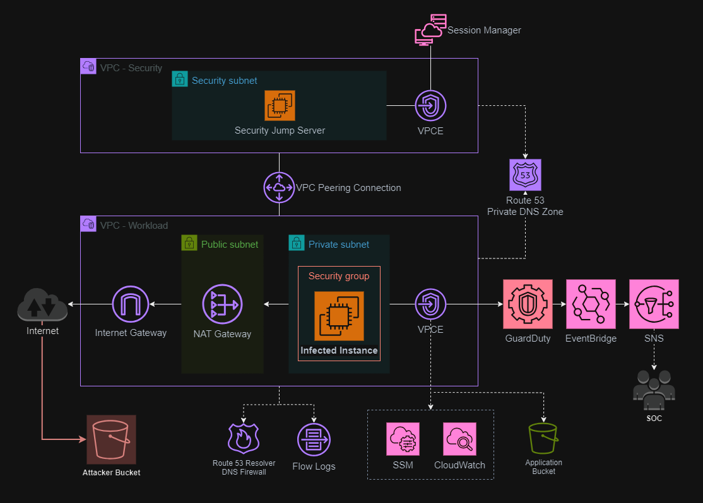
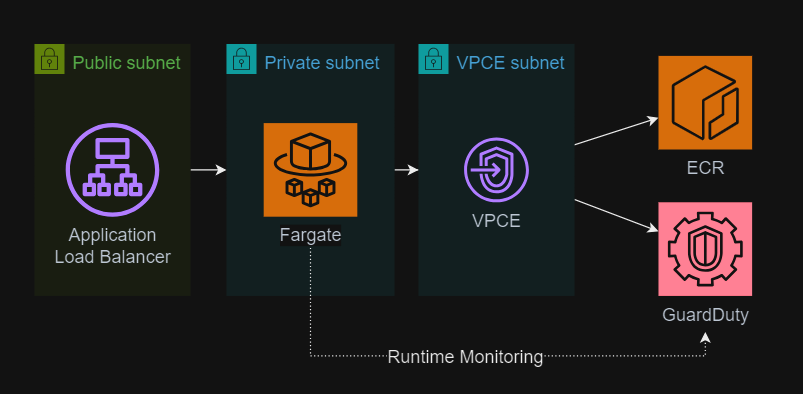
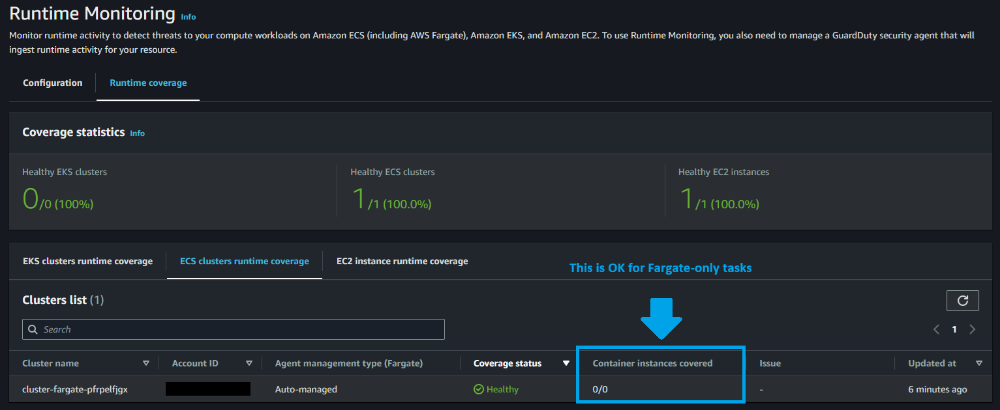

# AWS Security Operations

Simulation of detection, containment, and remediation techniques in AWS as part of a SOC approach.



## 🚀 Roadmap

Stuff that I need to do:

- [x] Application infrastructure
- [x] Security infrastructure
- [x] GuardDuty Runtime Monitoring
- [x] Route 53 DNS Firewall
- [x] Auto Scaling Group
- [x] Fargate Cluster
- [ ] S3 data exfiltration
- [ ] WAF
- [ ] Macie
- [ ] Inspector
- [ ] Detective
- [ ] Security Lake
- [ ] Honeypot
- [ ] Lateral movement

## 🏗️ Setup

Set up the `.auto.tfvars` file:

```sh
cp config/template.tfvars .auto.tfvars
```

At a minimum, set the `sns_email` variable to your test email. This will be used for a GuardDuty subscription and will require an approval after creation.

```terraform
sns_email = "subscriber@example.com"
```

The default `workload_type` is set to `ASG`, which will deploy the application workload in an Auto Scaling Group.

To start with an EC2 configuration, set this to true:

```terraform
enable_ec2 = true
```

Create the infrastructure:

```sh
terraform init
terraform apply -auto-approve
```

Check your email and approve the SNS subscription.

Connect to the instances and confirm that the setup was complete successfully:

```sh
# Connect using Session Manager
aws ssm start-session --target i-00000000000000000

# Elevate to super user
sudo su -

# Check the init script
cloud-init status
systemctl status amazon-cloudwatch-agent

# Update and upgrade if required
dnf check-update
dnf update
dnf upgrade
```

## Scenario 1: GuardDuty Runtime Monitoring for EC2 instances

Guidelines for remediating potentially compromised Amazon EC2 instances can be found [here][10].

### 🚨 1.1 Detection

Connect to the application instance and test a [GuardDuty Runtime Monitoring][3] finding. Example:

```sh
dig guarddutyc2activityb.com
```

This will force a [Backdoor:Runtime/C&CActivity.B!DNS][2] finding to be triggered.

In this simple example, the event will be captured in EventBridge and sent to an SNS topic. In a production use case, additional integration options may be implemented, not only notification, but also with a SOAR.

### 🛡️ 1.2 Containment

Upon detecting the threat, a security operations team may choose to quarantine the instance to protected the data.

In this exemple, run the [AWS-QuarantineEC2Instance][1] runbook. The security group `isolated-security-group` has been pre-created by Terraform to be in scope of the `destroy` stage.

> [!TIP]
> The instance should be kept running in quarantine as to provide a better inspection scenario.

Quarantining the instance directly can affect the service availability. Increasing the Auto Scaling Group size an allow additional instances to start would help mitigate such scenarios.

> [!IMPORTANT]
> A robust containment plan would include a remediation action that does minimal impact to production. One option in this case would be having a pre-baked AMI which could then be used to create a new server (assuming the AMI is not infected as well). A design based on Auto Scaling Groups is a good approach. If using standalone instances, this would likely require an integrated DevSecOps approach with the application and infrastructure teams, which is complex in planning and execution. When implementing Infrastructure as Code, the design should also consider such scenarios.

### 🕵️ 1.3 Inspection

An engineer would now be able to inspect the infected instance by logging into the security jump server, which is in a peered VPC.

Connectivity could be done via SSH, for example, by copying the application instance private key from Parameter Store:

```sh
aws ssm get-parameter \
    --name "wms-private-key-openssh" \
    --with-decryption \
    --query 'Parameter.Value' \
    --output text > rsa_private_key
```

Set the appropriate private key file permissions:

```sh
chmod 600 ~/.ssh/id_rsa
```

Connect to the infected instance via SSH:

```sh
ssh -i ./rsa_private_key ec2-user@infected.intranet.wms.com
```

## Scenario 2: GuardDuty Runtime Monitoring for ECS Fargate

To test GuardDuty capabilities for containers, set the project to create the ECS Fargate cluster.

> [!NOTE]
> Check the GuardDuty Runtime Monitoring [requirements][5] for AWS Fargate.

The architecture adds to the existing base VPC and workload resources:



Start by creating the cluster, ECR, and other resources:

```terraform
enable_fargate         = true
enable_fargate_service = false
```

Apply the Terraform configuration.

Upload the test images:

```sh
# Custom vulnerable app
bash apps/vulnerapp/ecr-push.bash

# Malware Crypto-miner container - https://artifacthub.io/packages/container/malware-cryptominer-container/malware-cryptominer-container
bash apps/cryptominer/ecr-push.bash
```

Set the project to create the ECS Fargate service:

```terraform
enable_fargate         = true
enable_fargate_service = true
```

Apply the Terraform configuration again. Confirm that the GuardDuty agent has been initiated as a sidecar for the task.

> [!IMPORTANT]
> Open the GuardDuty Runtime Monitoring console and confirm the coverage status, but also if the container instances are being covered. Check the [coverage troubleshooting][6] guide for help in identifying any technical issues, and also [troubleshooting FAQs][4].

As it is documented in the [coverage statistics considerations][7]:

> If your Amazon ECS cluster contains only Fargate tasks, the count appears as **0/0**.



Test a malicious call running in the test image:

```sh
curl http://<elb-public-endpoint>/guardduty/trigger
```

Another approach is to use a [honeypot container][8].

## Scenario 3: WAF

To enable WAF, first deploy the ECS Fargate cluster. Once that is done, enable WAF in the configuration.

> [!TIP]
> Change the `waf_allowed_country_codes` and other parameters to the desired region.

```terraform
enable_waf                = true
waf_allowed_country_codes = ["US"]
```

`apply` the configuration again.

To test the WAF rules:

```sh
cd test
bash loop.sh lb-fargate-012345678.us-east-2.elb.amazonaws.com
```

## Scenario 4: Bucket data exfiltration

The infrastructure for the application resources will be provisioned with S3 Buckets and VPC Endpoints (VPCE) of type `Gateway` and `Interface`.

The VPCE DNS configuration is set using both `Enable DNS name` and `Enable private DNS only for inbound endpoints`, following guidelines from the [documentation][11].

The application bucket is configured with a policy to accept connections only from the VPCE, and the VPCE accepts connections only to the specific S3 Buckets.

> [!TIP]
> Access to resources using VPC Endpoints must be declared explicitly, as it is explained in this [section][12] of the documentation. Example using the AWS CLI: `aws s3api delete-bucket-policy --bucket <bucket> --region <region> --endpoint-url https://bucket.<vpce-1a2b3c4d-5e6f>.s3.<region>.vpce.amazonaws.com`

Detecting data exfiltration in such scenarios is challenging, giving that connectivity would go through the trusted VPCE Interface for the application bucket, but would be going through the VPCE Gateway fora malicious/attacker bucket.

I'm looking to ways of further closing this type of scenario with this sandbox, and as well adding a firewall and IDPS/SIEM.

## Other scenarios

### Port scanning

To trigger a finding based on VPC Flow Logs, run a port scanning from the infected instance:

```sh
nmap 10.0.10.x
```

### Common findings

AWS offers a sample finding generator for [common GuardDuty findings][9].

---

### 🧹 Clean-up

Delete any snapshots created by quarantine automation.

Destroy the Terraform resources:

```sh
terraform destroy -auto-approve
```

## Reference

```
https://www.youtube.com/watch?v=fpShCxD8kFA
https://github.com/awslabs/amazon-guardduty-tester
https://docs.aws.amazon.com/AWSEC2/latest/UserGuide/security-group-connection-tracking.html
https://dev.to/aws-builders/aws-incident-response-how-to-contain-an-ec2-instance-pjk
https://github.com/epomatti/aws-cloudwatch-subscriptions
https://sysdig.com/blog/triaging-malicious-docker-container/
https://docs.aws.amazon.com/guardduty/latest/ug/sample_findings.html#guardduty_findings-scripts
```

[1]: https://console.aws.amazon.com/systems-manager/automation/execute/AWS-QuarantineEC2Instance
[2]: https://docs.aws.amazon.com/guardduty/latest/ug/findings-runtime-monitoring.html#backdoor-runtime-ccactivitybdns
[3]: https://docs.aws.amazon.com/guardduty/latest/ug/findings-runtime-monitoring.html
[4]: https://docs.aws.amazon.com/AmazonECS/latest/developerguide/ecs-guard-duty-troubleshooting.html#verify-ecs-runtime-ec2-run
[5]: https://docs.aws.amazon.com/guardduty/latest/ug/prereq-runtime-monitoring-ecs-support.html
[6]: https://docs.aws.amazon.com/guardduty/latest/ug/gdu-assess-coverage-ecs.html
[7]: https://docs.aws.amazon.com/guardduty/latest/ug/gdu-assess-coverage-ecs.html#ecs-review-coverage-statistics-ecs-runtime-monitoring
[8]: https://sysdig.com/blog/triaging-malicious-docker-container/
[9]: https://docs.aws.amazon.com/guardduty/latest/ug/sample_findings.html#guardduty_findings-scripts
[10]: https://docs.aws.amazon.com/guardduty/latest/ug/compromised-ec2.html
[11]: https://docs.aws.amazon.com/AmazonS3/latest/userguide/privatelink-interface-endpoints.html#private-dns
[12]: https://docs.aws.amazon.com/AmazonS3/latest/userguide/privatelink-interface-endpoints.html#accessing-bucket-and-aps-from-interface-endpoints
